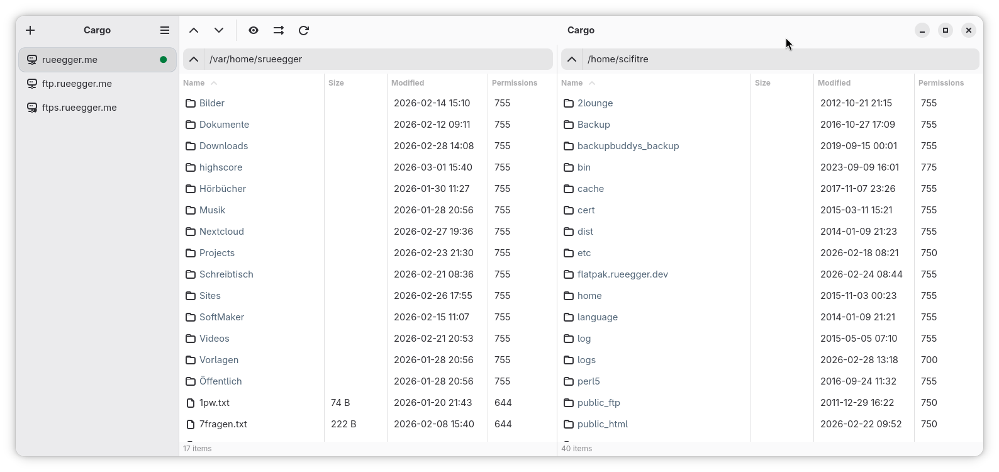
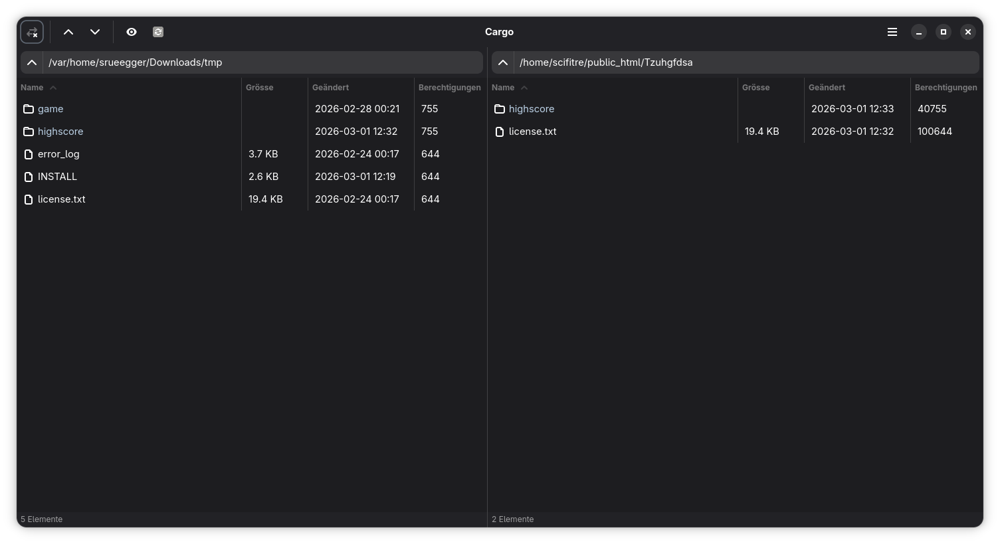
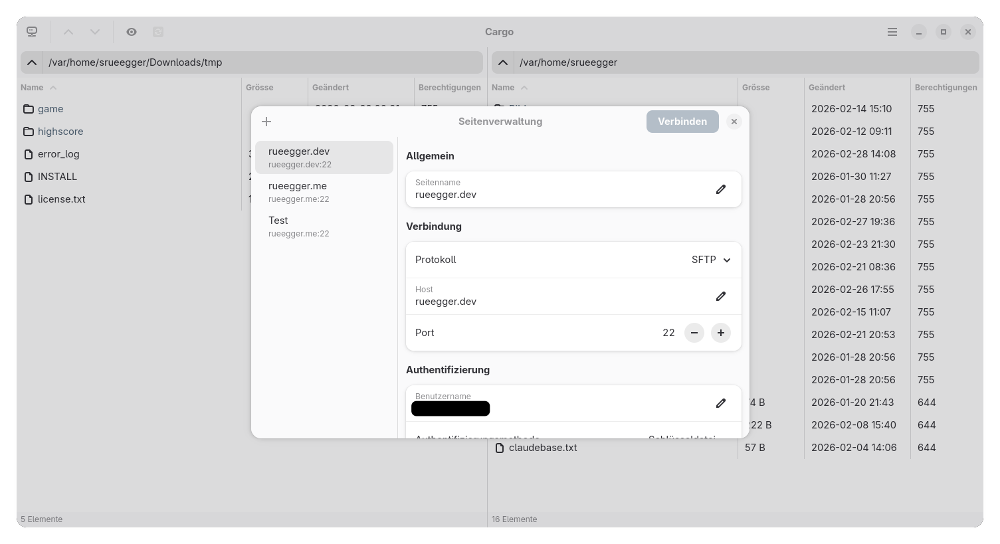
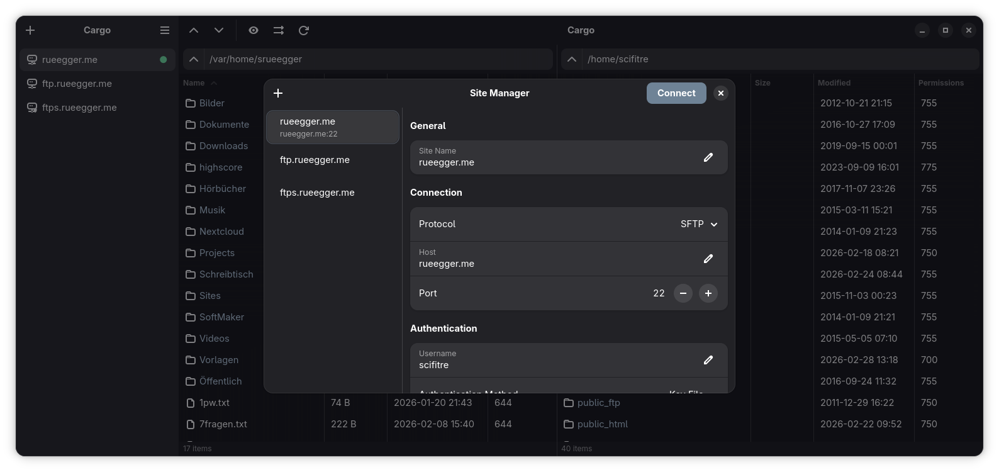
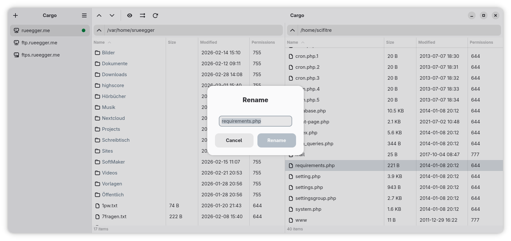
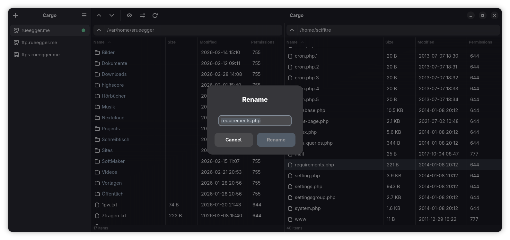

# Cargo

A dual-pane file transfer application for GNOME, built with GTK4 and libadwaita.

## Screenshots

### Dual-Pane File Browser
Browse local and remote files side by side. Transfer files between your machine and a server with a clear, split-panel layout.

| Light | Dark |
|-------|------|
|  |  |

### Site Manager
Save and organize your server connections. Supports FTP, FTPS, and SFTP with password, SSH key, or agent authentication.

| Light | Dark |
|-------|------|
|  |  |

### Overwrite Confirmation
When a file already exists at the destination, choose how to handle conflicts — overwrite, skip, rename, or apply a rule to the entire queue.

| Light | Dark |
|-------|------|
|  |  |

## Features

- **Dual-pane file browser** — Browse local and remote files side by side
- **FTP/FTPS support** — Connect to FTP servers with optional TLS encryption
- **SFTP support** — Secure file transfer over SSH with key, password, or agent authentication
- **Site Manager** — Save and organize your server connections
- **Quick Connect Sidebar** — One-click access to saved connections with protocol indicators
- **Transfer Queue** — Visual progress with pause, resume, and cancel controls per transfer
- **Synchronized Navigation** — Optionally keep both panels in sync when changing directories
- **GNOME Integration** — Follows GNOME Human Interface Guidelines with native libadwaita look

## Installation

### From Flatpak Repository

```bash
# Add the repository
flatpak remote-add --if-not-exists rueegger-dev https://flatpak.rueegger.dev/rueegger-dev.flatpakrepo

# Install Cargo
flatpak install rueegger-dev me.rueegger.cargo
```

### Building from Source

Requirements:
- Rust (stable toolchain)
- Meson >= 1.1
- GTK4 >= 4.20
- libadwaita >= 1.8
- gettext

```bash
meson setup build
meson compile -C build
meson install -C build
```

## Contributing

### Releasing a New Version

Use the release script to bump the version across all project files:

```bash
./scripts/release.sh <version> "<changelog description>"
```

This updates `Cargo.toml`, `meson.build`, translation files, and adds a
changelog entry to the AppStream metainfo. See [TECSTUFF.md](TECSTUFF.md)
for full technical documentation.

## Acknowledgments

- [suppaftp](https://github.com/veeso/suppaftp) — Super FTP/FTPS client library for Rust, powering our FTP/FTPS protocol support
- [russh](https://github.com/Eugeny/russh) — Pure-Rust SSH implementation used for SFTP connections
- [Tokio](https://tokio.rs) — Asynchronous runtime for Rust, used for non-blocking network I/O

## License

Cargo is licensed under the [GNU General Public License v2.0](LICENSE).

## Author

Samuel Rüegger — [samuel@rueegger](mailto:samuel@rueegger)
